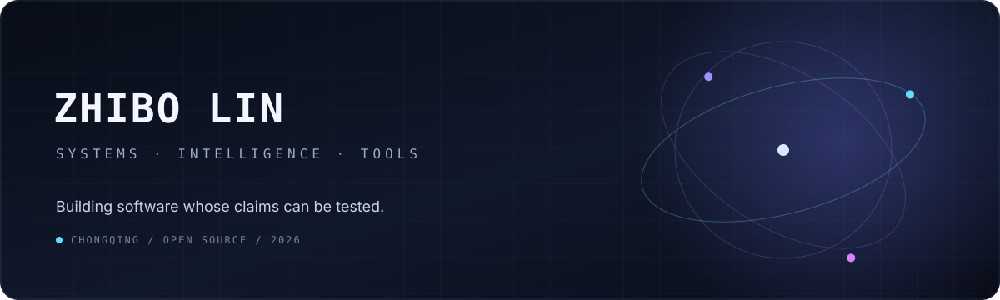

<div align="center">
  
</div>

<p align="center">
  <a href="https://github.com/LE0-Lin?tab=repositories">Repositories</a> ·
  <a href="https://github.com/search?q=is%3Apr+author%3ALE0-Lin&amp;type=pullrequests">Open-source work</a> ·
  <a href="https://www.linkedin.com/in/zhibo-lin/">LinkedIn</a> ·
  <a href="mailto:zhibo.lin@outlook.com">Email</a>
</p>

<p align="center"><em>I build production software around AI agents—from tool use and evaluation to APIs, data, and infrastructure.</em></p>

## Distinction

<table>
  <tr>
    <td width="22%" align="center" valign="middle">
      <h2>🥈 184 / 4,186</h2>
      <strong>Kaggle Silver Medal</strong>
    </td>
    <td width="78%" valign="middle">
      <h3><a href="https://www.kaggle.com/certification/competitions/leolin05/ai-agent-security-multi-step-tool-attacks">AI Agent Security — Multi-Step Tool Attacks</a></h3>
      <p>A red-teaming competition on discovering reproducible multi-step failures in tool-using agents. The benchmark covered exfiltration, untrusted-to-action flows, destructive writes, and confused-deputy behavior.</p>
      <p><sub>Competition sponsors: OpenAI · Google · IEEE</sub></p>
    </td>
  </tr>
</table>

## Selected work

<table>
  <tr>
    <td width="50%" valign="top">
      <h3><a href="https://github.com/LE0-Lin/AgentConfigScore">AgentConfigScore</a></h3>
      <p><strong>Trustworthy AI tooling</strong></p>
      <p>A deterministic regression gate for coding-agent instructions. It compares configuration changes against a baseline, reports line-addressable findings, and integrates with GitHub code scanning.</p>
      <p>
        <a href="https://pypi.org/project/agent-config-score/"></a>
        <a href="https://github.com/LE0-Lin/AgentConfigScore/stargazers"></a>
        <a href="https://github.com/LE0-Lin/AgentConfigScore/actions/workflows/ci.yml"></a>
      </p>
    </td>
    <td width="50%" valign="top">
      <h3><a href="https://github.com/LE0-Lin/health_bigdata_system_v4">Health Data System</a></h3>
      <p><strong>Data-intensive application engineering</strong></p>
      <p>An end-to-end analytics system spanning data collection and OCR, structured extraction, Flask services, Spark jobs, MySQL/Redis infrastructure, and validation tooling.</p>
      <p><code>Python</code> <code>Flask</code> <code>Spark</code> <code>MySQL</code> <code>Redis</code></p>
    </td>
  </tr>
</table>

## Upstream trace

Small patches in large systems are where engineering claims become testable.

| System | Merged work | What changed |
|:--|:--|:--|
| **.NET Runtime** | [#132601](https://github.com/dotnet/runtime/pull/132601) · [#132635](https://github.com/dotnet/runtime/pull/132635) | Runtime metadata and performance-sensitive API implementation |
| **Apache Airflow** | [#71883](https://github.com/apache/airflow/pull/71883) | Safer Kubernetes git-sync configuration |
| **Microsoft PowerToys** | [#50047](https://github.com/microsoft/PowerToys/pull/50047) | Stable command identity in Command Palette |
| **Apache Fineract** | [#413](https://github.com/apache/fineract-backoffice-ui/pull/413) · [#415](https://github.com/apache/fineract-backoffice-ui/pull/415) | Frontend test modernization and maker-checker workflows |
| **HiveMind** | [#82](https://github.com/Emiyaaaaa/HiveMind/pull/82) | Message handling and checkpoint management for a multi-agent system |

<p align="right"><a href="https://github.com/search?q=is%3Apr+author%3ALE0-Lin&amp;type=pullrequests">follow the full trail →</a></p>

## Working range

```text
Agent engineering    tool use · orchestration · context · model/API integration
AI reliability       security testing · replayable evaluation · guardrails · CI policy
Backend & data       APIs · databases · pipelines · distributed workflows
Systems & tooling    runtimes · containers · developer tools · open-source maintenance
Product engineering  full-stack integration · testing · deployment · maintainability
```

I am a Computer Science undergraduate at **Southwest University**, preparing for graduate study in the United States. My center of gravity is **software engineering around AI models**: turning model capabilities into dependable agents, services, workflows, and user-facing products. I enjoy working across the conventional SDE stack as much as the emerging agent stack—especially where APIs, tools, context, data, infrastructure, and evaluation meet.

## Selected private projects

Some of my project work is not mirrored on this public profile. These scopes are included to show the engineering range behind the public activity.

| Project | Scope | Engineering focus |
|:--|:--|:--|
| **Java Backend System** | A production-oriented service built with the Spring ecosystem | RESTful APIs · authentication · relational data modeling · maintainable service architecture |
| **AI Agent Application** | A backend application that connects language models with tools, APIs, and multi-step workflows | agent orchestration · tool integration · context handling · service design |
| **Database-backed Full-stack Application** | An end-to-end application connecting user workflows with structured backend services | React · Spring Boot · MySQL/PostgreSQL · frontend-backend contracts |

---

<p align="center">
  <sub>Interested in difficult systems, precise tools, and ideas that survive contact with reality.</sub>
</p>
